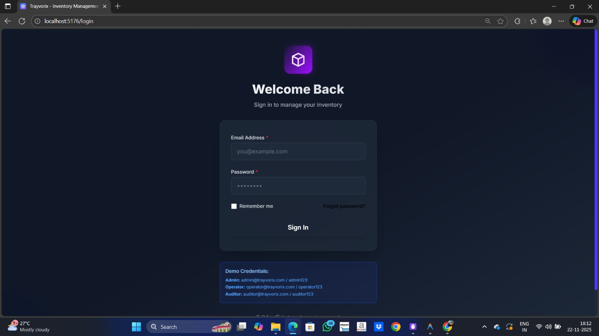
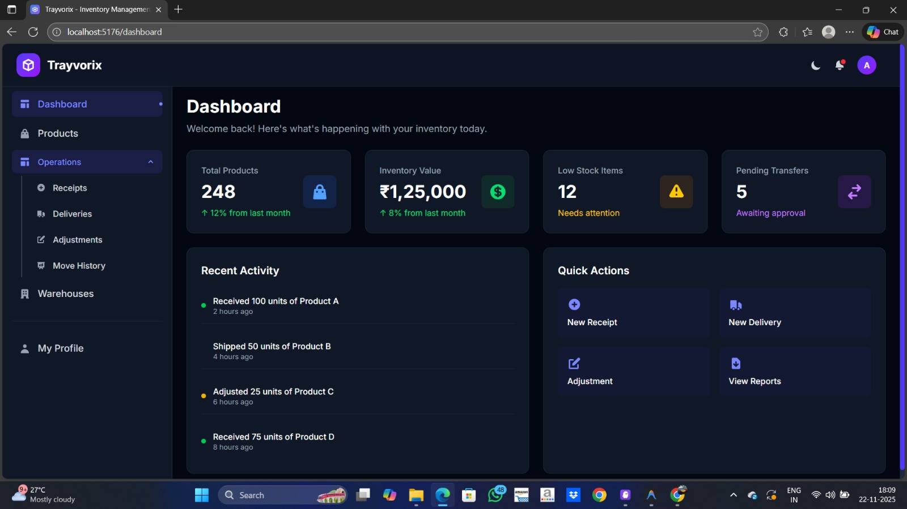
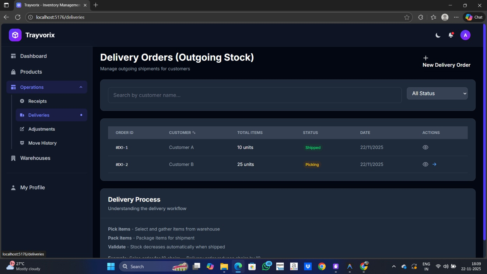
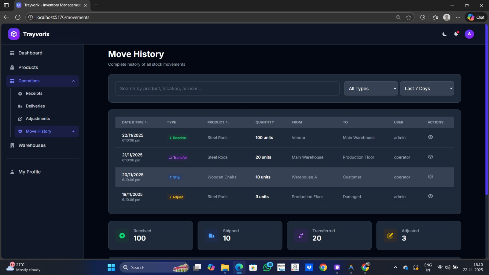
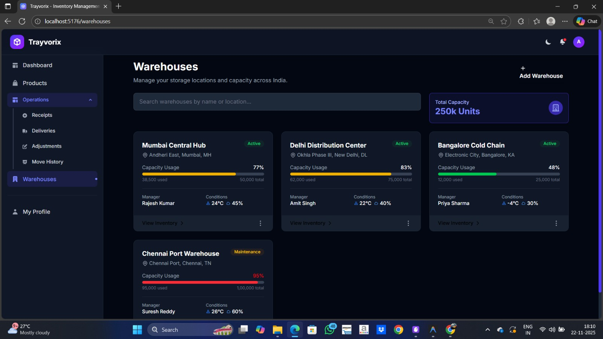
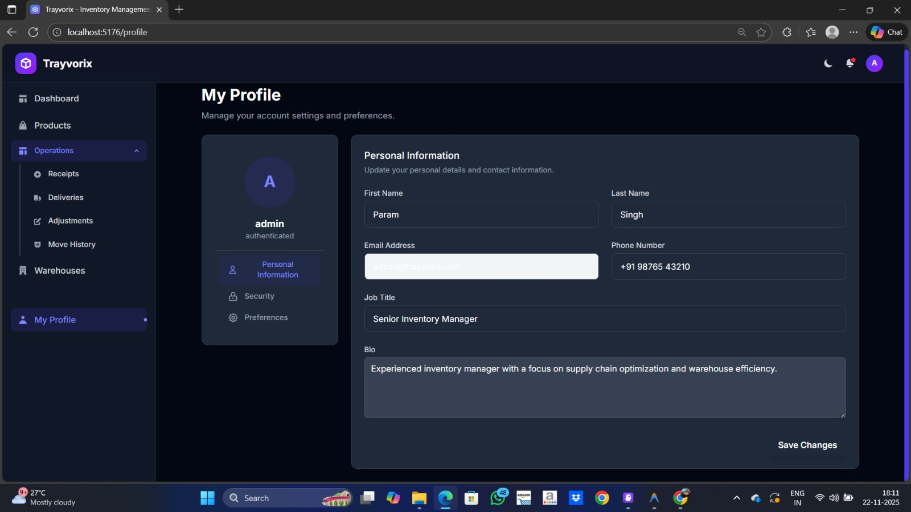
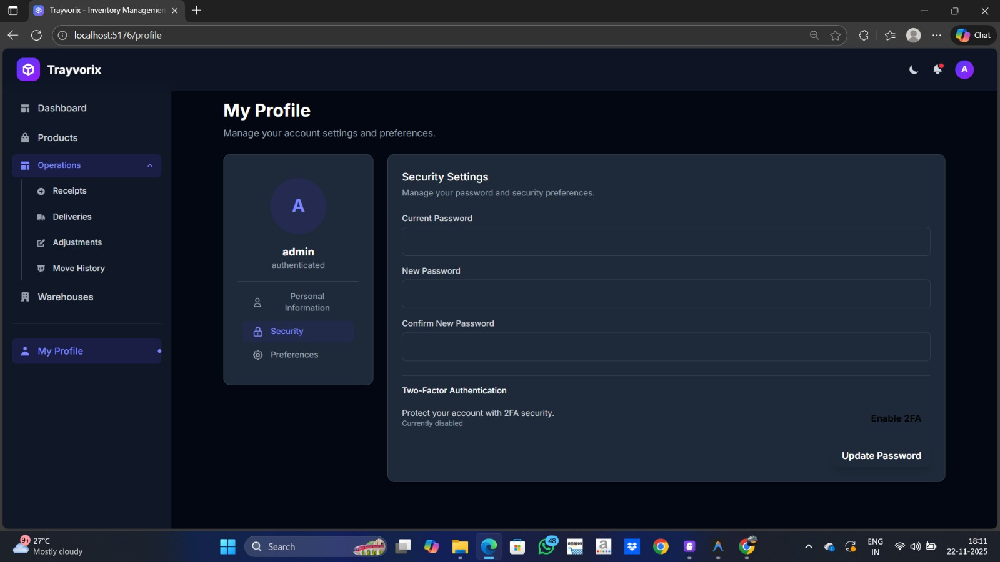

# REVIEW DEPLOYMENT
  EMAIL : admin@trayvorix.com
  PASSWORD : admin123
  
# Trayvorix - Advanced Inventory Management System

Trayvorix is a modern, cloud-native inventory management SaaS solution designed for multi-warehouse operations with real-time tracking, role-based access control, and intelligent automation.

## 🚀 Features

- **Multi-Warehouse Management** - Manage multiple warehouses with location hierarchies
- **Real-Time Inventory Tracking** - Live updates across all connected users
- **Role-Based Access Control** - Admin, Operator, Auditor, and Vendor roles
- **Stock Movement Operations** - Receiving, shipping, transfers, and adjustments
- **Barcode Scanning** - Mobile and webcam support for product verification
- **Batch Tracking** - Track products by batch with expiry date management
- **Audit Trail** - Complete traceability of all inventory changes
- **Analytics Dashboard** - KPIs, charts, and activity timeline
- **Notifications** - Real-time alerts for low stock, expiring batches, and approvals
- **Responsive Design** - Works seamlessly on mobile, tablet, and desktop
- **Progressive Web App** - Install and use offline
- 
## Screenshots

### Screen 1


### Screen 2


### Screen 3


### Screen 4


### Screen 5


### Screen 6


### Screen 7

## 🛠️ Tech Stack

- **Frontend**: React 18 + TypeScript + Vite
- **Styling**: TailwindCSS
- **State Management**: React Query + Context API
- **Backend**: Supabase (PostgreSQL + Auth + Storage + Real-time)
- **Routing**: React Router v6
- **Validation**: Zod
- **HTTP Client**: Axios

## 📋 Prerequisites

- Node.js 18 or higher
- npm or yarn
- A Supabase account (free tier works)

## 🔧 Installation

### 1. Clone the repository

```bash
git clone <your-repo-url>
cd trayvorix
```

### 2. Install dependencies

```bash
npm install
```

### 3. Set up Supabase

Follow the detailed instructions in [SETUP.md](./SETUP.md) to:
1. Create a Supabase project
2. Get your credentials
3. Run database migrations
4. Configure environment variables

### 4. Configure environment variables


Edit `.env`:
```
VITE_SUPABASE_URL=https://your-project.supabase.co
VITE_SUPABASE_ANON_KEY=your-anon-key-here
```

### 5. Run the development server

```bash
npm run dev
```

The application will be available at `http://localhost:5173`

## 📁 Project Structure

```
trayvorix/
├── src/
│   ├── components/     # Reusable UI components
│   ├── pages/          # Route pages
│   ├── contexts/       # React Context providers
│   ├── hooks/          # Custom React hooks
│   ├── services/       # API and external services
│   ├── utils/          # Utility functions
│   └── types/          # TypeScript type definitions
├── supabase/
│   └── migrations/     # Database migration files
├── public/             # Static assets
└── ...config files
```

## 🗄️ Database Schema

The database includes 15 main tables:
- `warehouses` - Warehouse locations
- `locations` - Storage locations within warehouses
- `categories` - Product categories (hierarchical)
- `products` - Product catalog
- `product_barcodes` - Barcode associations
- `batches` - Product batches with expiry tracking
- `inventory` - Current stock levels
- `stock_movements` - All inventory transactions
- `transfer_requests` - Inter-location transfer workflows
- `adjustments` - Inventory adjustments with approval
- `audit_logs` - Complete audit trail
- `notifications` - User notifications
- `tasks` - Task management
- `files` - File attachments

See [supabase/README.md](./supabase/README.md) for migration instructions.

## 👥 User Roles

- **Admin**: Full system access, user management, approvals
- **Operator**: Daily operations, stock movements, transfers
- **Auditor**: Read-only access for compliance and verification
- **Vendor**: Limited access to their supplied products

## 🚢 Deployment

### Vercel (Frontend)

```bash
# Install Vercel CLI
npm install -g vercel

# Deploy
vercel
```

### Supabase (Backend)

Your Supabase project is already deployed. Just ensure:
1. All migrations are run
2. RLS policies are enabled
3. Storage buckets are configured

## 📝 Available Scripts

- `npm run dev` - Start development server
- `npm run build` - Build for production
- `npm run preview` - Preview production build
- `npm run lint` - Run ESLint

## 🔐 Security

- JWT-based authentication via Supabase
- Row Level Security (RLS) enforced at database level
- Role-based access control
- Audit logging for all changes
- Secure file uploads with validation

## 📊 Key Features Detail

### Dashboard
- Real-time KPI cards
- Activity timeline
- Low stock alerts
- Expiring batch warnings
- Interactive charts

### Inventory Management
- Multi-location tracking
- Batch and expiry management
- Reserved quantity tracking
- Bulk import/export
- Barcode scanning

### Warehouse Operations
- Receiving workflows
- Shipping and picking
- Transfer requests with approval
- Location management
- Digital floorplans

### Reporting & Analytics
- Inventory turnover ratio
- Fill rate calculations
- Stock movement history
- Compliance reports
- Custom analytics

## 🤝 Contributing

This project was built for a hackathon. Contributions are welcome!


## 🙏 Acknowledgments

Built with modern web technologies and best practices for the hackathon.

## 📞 Support

For issues or questions, please open an issue on GitHub.

---

**Built with ❤️ for efficient inventory management**
